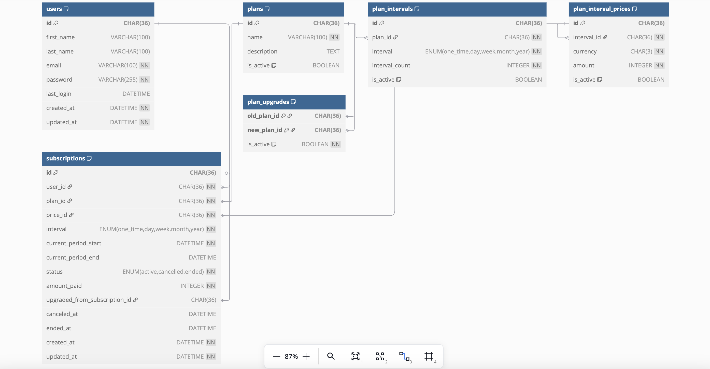

# Subscription Management Service

## Overview
A Flask-based subscription management system that handles user authentication, subscription plans, and subscription lifecycle management including upgrades and cancellations.

## Features
- **User Management**: Registration, authentication (JWT), and profile management
- **Plan System**: Hierarchical plan structure with multiple billing intervals and pricing options
- **Subscription Workflow**: Creation, upgrades, cancellations, and status tracking
- **Optimized Queries**: Database performance tuning for scalability

## Database Schema

## API Endpoints

### Authentication
| Endpoint | Method | Description |
|----------|--------|-------------|
| `/api/v1/auth/register` | POST | User registration |
| `/api/v1/auth/login` | POST | User login |

### Plan Management
| Endpoint | Method | Description |
|----------|--------|-------------|
| `/api/v1/plan` | POST | Create new plan |
| `/api/v1/plan` | GET | List all plans |

### Subscription Management
| Endpoint | Method | Description |
|----------|--------|-------------|
| `/api/v1/subscription` | POST | Create subscription |
| `/api/v1/subscription_upgrade` | PATCH | Upgrade subscription |
| `/api/v1/subscription` | PATCH | Cancel subscription |
| `/api/v1/subscription` | GET | List subscriptions |

## Query Optimization

### Database Indexes
```python
# Subscriptions table indexes
__table_args__ = (
    Index('idx_user_id', 'user_id'),
    Index('idx_plan_id', 'plan_id'),
    Index('idx_user_id_status', 'user_id', 'status'),
    Index('idx_plan_id_status', 'plan_id', 'status'),
    Index('idx_user_id_plan_id', 'user_id', 'plan_id')
)
```

# Detailed Explanation

This is a Flask-based subscription management service that handles user authentication, subscription plans, and subscription lifecycle management. Let me break down the key components with special emphasis on plans and subscription workflows.

## Core Components

### 1. User Management
- Handles user registration and authentication (JWT-based)
- Stores user details (name, email, password)
- Tracks last login time

### 2. Plan Management
- Defines different subscription plans with pricing options
- Manages billing intervals and pricing tiers
- Handles plan upgrades/downgrades

### 3. Subscription Management
- Creates and manages user subscriptions
- Handles subscription upgrades between plans
- Manages subscription cancellation
- Tracks subscription status and billing periods

## Detailed Plan System

### Plan Structure
The system has a hierarchical structure for plans:

1. **Plan** (Top level)
   - Name (e.g., "Basic", "Premium")
   - Description
   - Active status flag
   - Multiple billing intervals

2. **Plan Interval** (Middle level)
   - Billing frequency (one-time, daily, weekly, monthly, yearly)
   - Interval count (e.g., 1 month, 3 months)
   - Active status flag
   - Multiple pricing options

3. **Plan Interval Price** (Bottom level)
   - Currency (3-letter code like USD)
   - Amount (in smallest currency unit, e.g., cents)
   - Active status flag

### Key Features of Plans
- Unique naming: No two plans can have the same name
- Flexible billing: Supports one-time and recurring (daily/weekly/monthly/yearly) billing
- Multiple currencies: Each interval can have prices in different currencies
- Active/inactive control: Plans can be enabled/disabled without deletion

## Subscription System

### Subscription Creation
User selects a price (which is tied to a specific plan and interval)

System:
1. Validates the price exists and is active
2. Checks user doesn't already have an active subscription to this plan
3. Sets up billing period based on interval
4. Records amount paid
5. Sets status to "active"

### Subscription Upgrade Workflow

**Validation Checks:**
- User must have an active subscription to upgrade from
- New plan must be different from current plan
- Upgrade path must be defined in `plan_upgrades` table
- New price must be for the same interval type can't switch from monthly to yearly
- New price must be equal or higher than current (no downgrades via upgrade path)

**Proration Calculation:**
1. Calculates remaining days in current subscription period
2. Determines unused value based on daily rate
3. Applies credit to new subscription

**Execution:**
1. Creates new subscription with:
   - New plan and price
   - Full new billing period
   - Adjusted amount paid (original price minus credit)
   - Reference to original subscription
2. Marks old subscription as "ended"

### Subscription Cancellation
- Sets `canceled_at` timestamp
- Subscription remains active until end of current billing period
- Can be distinguished from terminated subscriptions

## Database Schema Highlights

### Key Tables
- `plans`: Stores plan definitions
- `plan_intervals`: Billing frequency options for each plan
- `plan_interval_prices`: Pricing for each interval
- `plan_upgrades`: Defines valid upgrade paths between plans
- `subscriptions`: Tracks user subscriptions

### Important Relationships
- One plan → many intervals
- One interval → many prices
- Subscription → one plan and one price
- Subscription → can upgrade to another subscription


## Business Logic Highlights

### Upgrade Restrictions:
- Only predefined upgrade paths allowed (via `plan_upgrades` table)
- Prevents arbitrary plan switching
- Ensures only monetarily positive upgrades (no downgrades via upgrade path)

### Proration:
- Fair calculation of unused subscription value
- Credit applied to new subscription
- Prevents users from losing paid value when upgrading

### Validation:
- Comprehensive checks at every step
- Prevents invalid state transitions
- Maintains data integrity

This service provides a complete foundation for a subscription-based business with flexible plan structures, secure user management, and controlled upgrade paths. The proration system ensures fair billing during upgrades, while the validation layers maintain system integrity.

